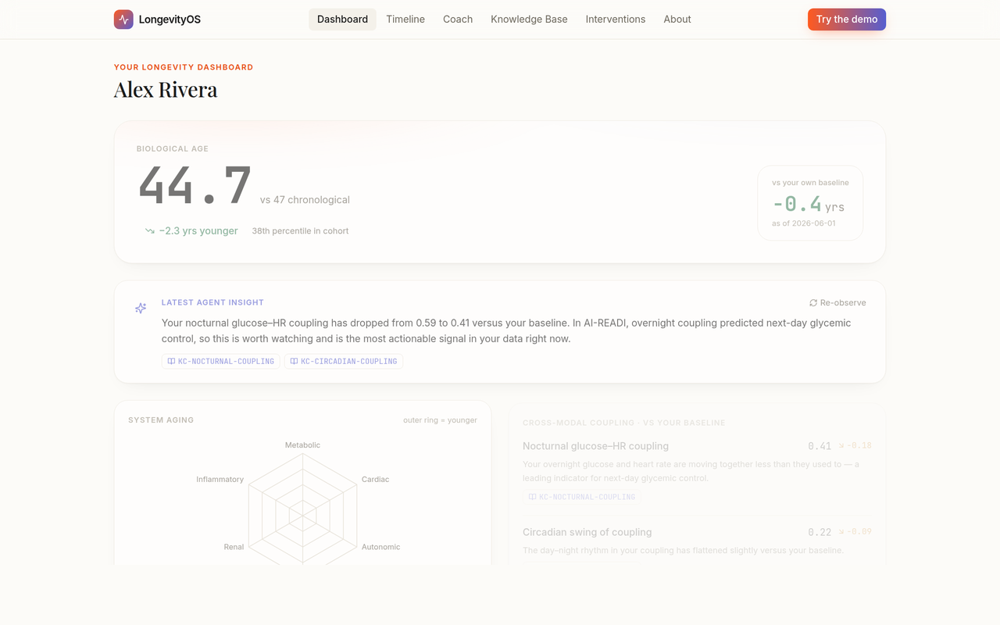
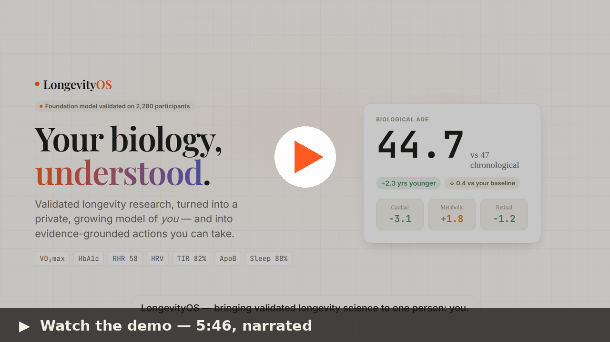
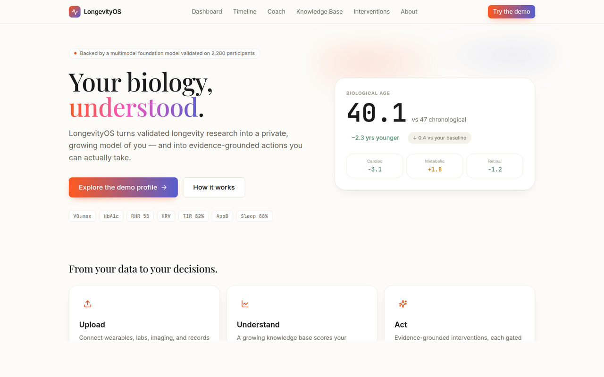

# LongevityOS

**A personal longevity operating system.** Upload your own wearable, clinical, omics, and
imaging data; LongevityOS builds a growing, private knowledge base about *you*, scores your
multimodal biological aging, and recommends evidence-grounded interventions — powered by a
multimodal foundation model and an agentic discovery engine validated on the AI-READI cohort.

<p align="center">
  <a href="https://longevity-os-sable.vercel.app/"><b>&#9654;&nbsp; Try the live demo</b></a>
  &nbsp;&nbsp;·&nbsp;&nbsp;
  <a href="https://drive.google.com/file/d/14LRMQ9f3TXppVOi34LEg033tmwcUvXGD/view?usp=sharing"><b>&#127916;&nbsp; Watch the demo video</b></a>
  &nbsp;&nbsp;·&nbsp;&nbsp;
  <a href="https://longevity-os.xyz/"><b>&#127760;&nbsp; Website</b></a>
</p>

---

## &#9654;&nbsp; Live demo — try it now

### 👉 **[longevity-os-sable.vercel.app](https://longevity-os-sable.vercel.app/)**

The full interactive app, running live on a synthetic user. Click the screenshot to open it.

<a href="https://longevity-os-sable.vercel.app/">
  
</a>

Walk a real person's data end-to-end: the **biological-age scorecard**, the **system-aging radar**,
grounded **knowledge cards**, and **gated interventions** from a multi-agent care team.
*Wellness & informational — not medical advice; all demo data is synthetic.*

## 🎬 Demo video — 5:46, narrated

A code-defined ([Remotion](https://www.remotion.dev/)) walkthrough: the problem → the **AI-READI**
dataset → the **JEPA foundation model** I trained (under submission to *Nature Aging*) → the
**agentic discovery system** → the app → evaluation, integrity & disclosure.

<a href="https://drive.google.com/file/d/14LRMQ9f3TXppVOi34LEg033tmwcUvXGD/view?usp=sharing">
  
</a>

▶ **[Watch on Google Drive →](https://drive.google.com/file/d/14LRMQ9f3TXppVOi34LEg033tmwcUvXGD/view?usp=sharing)**

### The landing page

<a href="https://longevity-os-sable.vercel.app/">
  
</a>

A companion **research-engine explainer** site also lives at **[longevity-os.xyz](https://longevity-os.xyz/)**.

---

## The idea in one picture

```
   AI-READI research engine                LongevityOS (this repo)
   (population → knowledge)                 (knowledge → the individual)
  ┌───────────────────────────┐           ┌──────────────────────────────┐
  │ • Foundation model (JEPA) │  export   │ engine/   research substance  │
  │ • Agentic discovery       │ ───────▶  │ backend/  FastAPI app layer   │
  │ • Hypothesis backbone     │ artifacts │ frontend/ polished personal UI│
  │ • Validated findings      │  + cards  │ data/     YOUR growing record │
  └───────────────────────────┘           └──────────────────────────────┘
```

The companion **showcase website** (`vector-longevityos`) presents the *research engine*.
**This repo** is the *interactive product*: an app a real person uses to understand and act on
their own data.

## Two surfaces

| Surface | What it is | Where |
| --- | --- | --- |
| **Showcase site** | Marketing/explainer for the research engine and science | separate repo |
| **Interactive app** | Upload → personal knowledge base → scores → interventions | `frontend/` + `backend/` here |

## Repository layout

```text
LongevityOS/
  engine/                 Research substance copied from AI-READI (the "knows about it" core)
    foundation_model/     Multimodal JEPA encoders (inference-only here; trained on the cluster)
    agentic/              Agentic discovery framework (agentic_discovery + agents)
    hypothesis/           Hypothesis-driven backbone + 27 stored hypotheses
    science/              Loaders, feature formulas, coupling, aging-clock scoring
    knowledge_cards/      Validated findings distilled as evidence priors the agent cites
  backend/                FastAPI app: users, ingest, knowledge base, scoring, agent, interventions
  frontend/               Next.js + Tailwind + shadcn/ui interactive app (build locally)
  data/
    demo_users/           Synthetic sample users so the app runs without the AI-READI dataset
  model_artifacts/        Exported frozen models + reference distributions (weights gitignored)
  docs/                   Architecture, build guide, frontend spec, demo script, claims map
```

## Quickstart (local)

```bash
# 1. Backend (Python)
cd backend
pip install -r requirements.txt
uvicorn longevityos_api.main:app --reload --port 8000
# open http://localhost:8000/docs  (interactive API)

# 2. Frontend (Node 20+)
cd ../frontend
npm install
npm run dev
# open http://localhost:3000
```

The backend serves a synthetic demo user out of the box, so the frontend has real-shaped data
to render before you wire in your own uploads.

## Documentation

- **[docs/BRAINSTORM.md](docs/BRAINSTORM.md)** — vision, the research→individual reframe, design rationale
- **[docs/ARCHITECTURE.md](docs/ARCHITECTURE.md)** — components, data flow, per-user knowledge base
- **[docs/BUILD_GUIDE.md](docs/BUILD_GUIDE.md)** — phased plan to take this from slice to product
- **[docs/DEPLOY.md](docs/DEPLOY.md)** — deploy frontend (Vercel) + backend (Render/Railway/Fly): env vars, CORS, live coach
- **[docs/FRONTEND_SPEC.md](docs/FRONTEND_SPEC.md)** — detailed spec for the polished UI (for v0 / Cursor / Claude Code)
- **[docs/DEMO_SCRIPT.md](docs/DEMO_SCRIPT.md)** — what to show the class + talking points for FM / agentic / hypothesis
- **[docs/PROVENANCE.md](docs/PROVENANCE.md)** — exactly what was copied from AI-READI and at which commit
- **[docs/research_engine/](docs/research_engine/)** — the original research design docs (FM, agentic, hypothesis)

## What it is, and why (the bet)

Population longevity research produces aging clocks and coupling findings, but a *person* can't act
on a paper. LongevityOS runs that engine **in reverse**: it takes models validated on a population
and turns them onto one individual's own data. And because a cohort clock on a single person has
wide error bars, it leads with the honest signal — **within-person change against your own
baseline** (a clean N-of-1 control) — rather than a shaky cohort percentile.

## What I built (and the research underneath)

- **A multimodal JEPA foundation model I trained** on AI-READI's synchronized 10-day physiology
  (glucose, heart rate, activity, environment) + frozen retinal/cardiac encoders. It's
  **control-validated** (real, time-aligned windows beat wrong-day and wrong-person controls across
  **36 GPU runs × 4 horizons × 3 seeds**) and is **currently under submission to *Nature Aging***.
  → `docs/research_engine/reports/JEPA_SYSTEMATIC_SUMMARY_20260428.md`
- **An agentic discovery system** built on the **Claude Agent SDK** — specialist agents that
  hypothesize, run, and verify, with **guarded tools (no raw shell)** and **three reviewer gates**.
  It produced **27 hypotheses** and a coupling atlas (glucose–HR coupling alone separates
  insulin-dependent from healthy at **AUROC 0.80**). → `engine/agentic/`, `engine/hypothesis/`
- **The interactive app** — Next.js + Tailwind frontend over a FastAPI backend: upload → growing
  knowledge base → biological-age scorecard, system radar, grounded knowledge cards, and gated
  interventions. → `frontend/`, `backend/`
- **A code-defined demo video** (Remotion, narrated) — project on the `claude/tender-goldberg-cDzjU`
  branch under `video/`.

## Evidence & evaluation

- **Control-validated foundation model.** Aligned < wrong-day < wrong-person, repeated across random,
  event, horizon, and event-type suites; the aligned advantage decays with horizon — physiologically
  plausible, not a static shortcut.
- **Honest hypothesis ledger.** 27 hypotheses through propose → critique → verify, with supported,
  refuted, and open verdicts all retained (`engine/hypothesis/results/`).
- **Baselines & citations.** Aging-clock benchmarks (best multimodal-static MAE 5.20 yr, R² 0.65);
  coupling-only AUROC 0.80 for insulin-dependent vs healthy.
- **Stated limitations.** ~2,280 participants is small for from-scratch temporal encoders; static
  phenotype shortcuts coarse age/severity; results show *predictability*, not causal mechanism.
  Wellness-scoped — **not medical advice**; demo data is synthetic.

## AI usage & disclosure

Per the course AI policy, here is exactly how and where AI tools were used:

- **Claude Code (Anthropic)** scaffolded and built the **interactive app** (Next.js frontend +
  FastAPI backend), the polished UI, and the **demo video** (the Remotion project), and assisted in
  drafting the docs/README (author-reviewed).
- The **Claude Agent SDK** powers the **agentic discovery system** in the research engine.
- The **Anthropic API** powers the app's **multi-agent care team**.
- **Not AI-generated:** the **JEPA foundation model**, the AI-READI analyses, and the scientific
  findings are my own research work — AI tools assisted with implementation and refactoring, not the
  science.

## Credits, sources & repo

- **AI-READI dataset** v3.0.0 — DOI [10.60775/fairhub.3](https://doi.org/10.60775/fairhub.3) (NIH
  Bridge2AI; PI Aaron Lee, MD). Used under its data-use agreement; **no participant data is
  redistributed**.
- **RETFound** (retinal) and **ECGFounder** (cardiac) foundation models — used as frozen encoders.
- `engine/` is curated from my own AI-READI research workspace at commit `1530e4c` — see
  [docs/PROVENANCE.md](docs/PROVENANCE.md) for exactly what was copied.
- Built with [Remotion](https://www.remotion.dev/), Next.js, Tailwind, and FastAPI.
- **Repo & process:** private repo with **access granted to course staff**; full **commit history**
  and development artifacts (research reports in `docs/research_engine/`, the hypothesis ledger,
  design docs) are included as evidence of work over time.

## Provenance & data ethics

`engine/` is a curated copy of the AI-READI research workspace at commit `1530e4c`
(2026-05-21). **No AI-READI participant data is included** — only source code, design docs, and
distilled findings. Demo users are synthetic. Do not commit real personal health data; `data/`
upload paths are gitignored.
